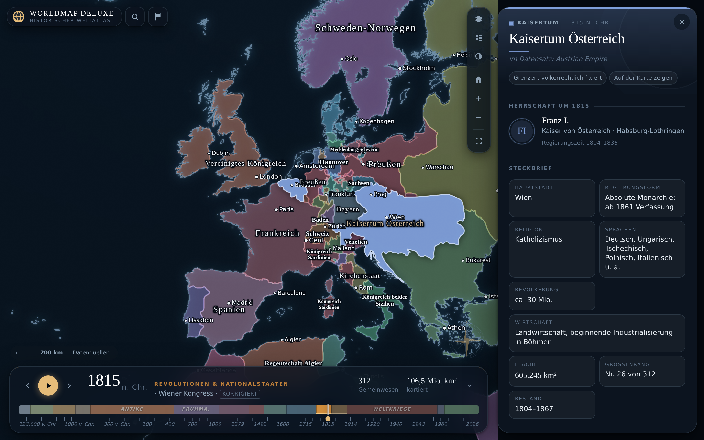
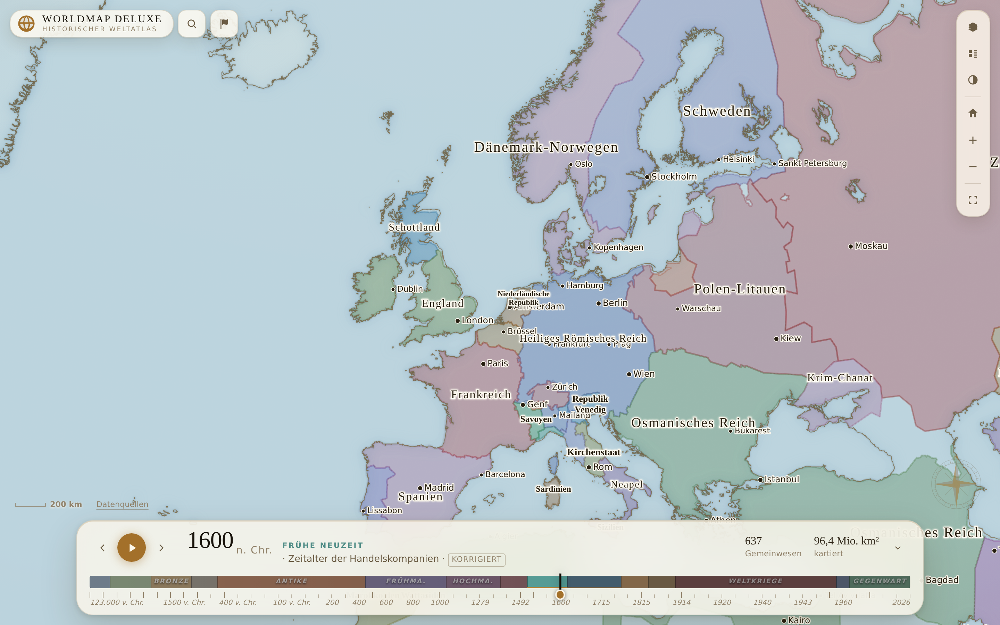

# Worldmap Deluxe

**→ [canuzu.github.io/Worldmap-Deluxe](https://canuzu.github.io/Worldmap-Deluxe/)**

Ein interaktiver historischer Weltatlas: **62 Zeitschnitte von 123.000 v. Chr. bis 2026**.
Der Regler unten schiebt die Weltkarte durch die Jahrtausende – Reiche wachsen,
Grenzen verschieben sich, Kulturen verschwinden. Ein Klick auf ein Gebiet öffnet
den Steckbrief für genau dieses Jahr: Herrscher, Hauptstadt, Regierungsform,
Religion, Bevölkerung, Wirtschaft, Wendepunkte und Nachbarn.



<sup>Nachtatlas – Europa nach dem Wiener Kongress, mit Steckbrief des Kaisertums Österreich</sup>



<sup>Pergament – Europa 1600; die Küstenlinien folgen Natural Earth 1:10 Mio.</sup>

## Was der Atlas kann

| | |
|---|---|
| **Zeitregler** | jahresgenau wählbar; die Karte zeigt den nächstgelegenen der 62 Kartenstände und schreibt darunter, welcher das ist |
| **Zeitreise** | Wiedergabetaste läuft alle Epochen durch, mit Überblendung zwischen den Zeitschnitten |
| **Detailtafel** | Steckbrief je Gemeinwesen und Jahr – kuratierte Texte, Angaben aus dem Kartendatensatz, optional ein Wikipedia-Auszug |
| **Herrscher zum Jahr** | 1.182 Regierungszeiten in 86 Gemeinwesen: Wer 1530 wählt, sieht Süleyman, wer 1900 wählt, Abdülhamid II. Die Regierungsfolge darunter ist anklickbar und nimmt die Karte mit |
| **Ereignisse auf der Karte** | 174 Verträge, Gründungen, Fahrten, Seuchen, Werke und Umbrüche – eingetragen dort, wo sie geschahen. Gezeigt wird, was in die Zeitspanne des jeweiligen Kartenstands fällt; Entdeckungsfahrten laufen als Route mit |
| **Nachbarn** | aus der Kartentopologie berechnet und anklickbar: eine Region lässt sich Nachbar für Nachbar erwandern |
| **Besetzte Gebiete** | 1800, 1815, 1916/1918, 1920, 1940–1945 und 1960–2026: besetztes Land behält seine Farbe und trägt darüber eine Schraffur in der Farbe der Besatzungsmacht – von den napoleonischen Tochterrepubliken über die vier Zonen von 1945 bis zur Krim |
| **Eiszeitliche Küstenlinie** | für die Zeitschnitte vor 10.000 v. Chr.: Doggerland, Beringia und Sundaland liegen trocken, so wie sie es waren |
| **Landschaftsnamen** | Gebirge, Wüsten, Hochebenen – sie erklären, warum Grenzen verlaufen, wie sie verlaufen |
| **Kartengrundlage** | wahlweise Relief- oder physische Geländekarte unter den historischen Grenzen – bewusst ohne heutige Straßen, Städte oder Staatsgrenzen. Abschaltbar; ohne sie zeichnet der Atlas wie zuvor alles selbst |
| **Orte zur Orientierung** | heutige Städte mit deutschen Namen, gestaffelt nach Rang eingeblendet – ohne sie ist die Karte ab Zoomstufe 6 anhaltslos |
| **Kriege & Schlachten** | 87 Kriege und 175 Schlachten von Kadesch bis Bachmut. Das Register zeigt, was im eingestellten Jahr läuft – mit einem Balken, der die Dauer und den Stand angibt. Ein Klick legt die Kriegsparteien farbig auf die Karte und nummeriert seine Schlachtfelder in der Reihenfolge, in der sie geschlagen wurden |
| **Berühmte Schlachten** | Gaugamela, Hastings, Waterloo, Stalingrad – der Verlauf läuft Station für Station ab, die Stellungen verschieben sich mit |
| **Vollbild** | <kbd>V</kbd> nimmt den ganzen Bildschirm, <kbd>F</kbd> blendet die Bedienelemente aus – beides einzeln, weil beides einzeln sinnvoll ist |
| **Vier Einfärbungen** | nach Gemeinwesen, Oberhoheit, Kulturraum oder Genauigkeit des Grenzverlaufs |
| **Suche** | über alle Gemeinwesen des aktuellen Zeitschnitts, deutsch und in der Schreibweise des Datensatzes |
| **Zwei Farbwelten** | „Nachtatlas“ und „Pergament“ |
| **Teilbare Links** | Ausschnitt, Jahr und Auswahl stehen in der Adresszeile: `#position=3.4/48/22&year=1815&ort=Austrian%20Empire` |

Die Karte kommt **ohne Kacheldienst** aus: Küstenlinien, Seen, Flüsse und
historische Grenzen werden als Vektoren gezeichnet. Der Atlas läuft damit
vollständig eigenständig und ohne Verbindung zu Drittanbietern – die einzige
optionale Ausnahme sind die abschaltbaren Wikipedia-Auszüge.

## Wie die Karte aussieht, und warum

Der Atlas soll wie eine gestochene Tafel wirken, nicht wie ein Kartendienst.
Sechs Entscheidungen tragen das:

**Der Küstensaum.** Über dem Meer liegt eine Linienebene, in die zwei Bänder
nacheinander gezogen werden: ein breites, blasses für die Tiefe und ein enges,
fast scharfes für die Kante. Weich wird der Verlauf nicht durch einen
Weichzeichner, sondern durch immer breitere, blassere Parallelen – genau das
Verfahren, mit dem Kupferstecher Untiefen angelegt haben, bevor es
Weichzeichner gab. Nichts sonst verändert das Kartenbild so stark. Der Saum
liegt zur Hälfte auf dem Land, deshalb laufen Breite und Deckung mit der
Zoomstufe zurück – im Weltmaßstab umreißt er die Kontinente, in der Nahsicht
bleibt nur die Kante.

**Gerundete Ecken.** Der Ursprungsdatensatz zeichnet viele Gemeinwesen mit
sehr wenigen Stützpunkten – Bayern 1815 besteht aus knapp fünfzig, jeder Zug
ist eine gerade Strecke mit einer spitzen Ecke am Ende. Das liest sich wie ein
Polygonzug, nicht wie eine Grenze. Ein eigenes Zeichenwerk schneidet deshalb
jede Ecke ab: Die Linie geht ein Stück vor dem Stützpunkt weg, kommt ein Stück
danach wieder an, dazwischen liegt eine Kurve mit dem Stützpunkt als Griff.

Der Radius wächst mit der Länge der angrenzenden Strecken und ist auf deren
Hälfte begrenzt. Dadurch bleibt die Geometrie unangetastet: Dicht gezeichnete
Küsten und lange gerade Grenzen ändern sich nicht, weil dort die Begrenzung
greift – nur grobe, spitze Ecken werden weich. Fläche, Randlinie, Schraffur
und Auswahl entstehen aus demselben Pfad und können nicht auseinanderlaufen;
für die SVG-Ebene der Auswahl gibt es dieselbe Rundung ein zweites Mal, aber
denselben Code nur einmal.

**Antiqua auf der Karte.** Länder tragen im gedruckten Atlas seit
Jahrhunderten eine Serifenschrift, und große Namen werden nicht fett gesetzt,
sondern gesperrt. Beides macht der Atlas jetzt auch.

**Ein Rückhalt statt einer Kontur.** Beschriftungen bekommen einen weichen
Schatten und eine schmale Kontur statt einer einzigen dicken – bei einer
Antiqua liefen die Serifen sonst zu.

**Schwebende Instrumente.** Zeitleiste, Detailtafel und Werkzeugsäule sind
gerundete Tafeln mit haarfeiner Kante und einem Lichtstrich oben, mit Abstand
zum Bildrand. Vorher war die Zeitleiste ein durchgehendes Band, das die Karte
unten abschnitt wie eine Fußzeile.

**Ein gedämpftes Epochenband.** Fünfzehn vollgesättigte Farbblöcke stritten
mit der Karte um Aufmerksamkeit. Jetzt ist nur die Epoche hell, in der man
gerade steht.

Dazu Titelmarke und Windrose: Die Seite sagt, was sie ist, und dass hier ein
Kartenwerk liegt.

**Und ein Prüfwerkzeug dafür.** „Teils verschoben“ ist von Hand kaum zu
finden: Es sind fünf Fenstergrößen mal sechs Zustände, und die Fehler zeigen
sich nur in bestimmten Kombinationen. `npm run check:layout` fährt alle
dreißig ab und meldet Überschneidungen und Überläufe. Gefunden wurden damit
ein Ebenenmenü, das bei **jeder** üblichen Fenstergröße unten aus dem Bild
lief, ein Schlachtenfenster auf der Quellenzeile und eine Detailtafel, die
auf dem Telefon die Werkzeugsäule halb abdeckte. Gemeldet wird nur, was
stört – eine höher liegende, deckende Fläche darf verdecken.

## Wie die Umrisse zustande kommen

Historische Grenzdatensätze bringen ihre eigenen, meist groben Küstenlinien
mit. Damit die Länder trotzdem exakt die Form haben, die sie auf einer
heutigen Weltkarte haben, geht der Atlas einen Umweg:

1. **Die Grenzverläufe werden nicht vereinfacht.** Die Rohdaten enthalten je
   Zeitschnitt 30.000 bis 110.000 Stützpunkte – als quantisiertes TopoJSON
   sind das 30 bis 500 kB je Datei. Jede Ausdünnung wäre sichtbar, ohne
   nennenswert Ladezeit zu sparen.
2. **Gezeichnet wird nicht das Land, sondern das Meer.** `ocean-hd.json` ist
   ein einziges Polygon mit einem Loch je Landmasse, abgeleitet aus Natural
   Earth 1:10 Mio. (rund 300 m Auflösung). Diese Ebene liegt **über** den
   Grenzflächen und schneidet sie exakt an der echten Küstenlinie ab.
3. **Ein schmaler Saum weitet jede Fläche um gut einen Pixel.** Das schließt
   die Lücken, die entstehen, weil die historischen Umrisse nicht ganz bis an
   die heutige Küste reichen. Nach außen schneidet das Meer den Überschuss
   wieder ab.

Der Umweg über das Meer statt eines Zuschnitts jeder einzelnen Epoche ist der
Grund, warum das Ganze schlank bleibt: Beim Zuschneiden trüge jede der 62
Dateien dieselben Küstenpunkte mit sich und wäre rund viermal so groß. So wird
die Küstenlinie genau **einmal** geladen – und die Umrisse sind trotzdem exakt.

Beim Zoomen ins Weltbild genügt eine grobe Küstenlinie (`ocean.json`, 210 kB
gzip); die hochaufgelöste Fassung rückt im Hintergrund nach und wird ab
Zoomstufe 4,2 eingeblendet. Seen und Flüsse werden erst geholt, wenn man die
Ebene einschaltet.

## Schnellstart

```bash
npm install
npm run dev        # http://127.0.0.1:5173
```

Die aufbereiteten Kartendaten liegen bereits unter `public/data/` im Repository
(rund 22 MB). Für den Betrieb ist kein Datenbau nötig. Übertragen wird beim
Aufruf nur ein Bruchteil davon: rund 210 kB Küstenlinie, ein Zeitschnitt
(je nach Epoche 15–420 kB gzip) und die Wissensbasis.

```bash
npm run build      # erzeugt dist/
npm run preview    # gebaute Fassung prüfen
```

## Aufbau

```
index.html                 Grundgerüst der Oberfläche
src/
  main.js                  Verdrahtung: Zustand, URL-Hash, Tastatur, Werkzeuge
  modules/
    atlas.js               Leaflet-Karte, Ebenen, Überblendung, Auswahl
    labels.js              Beschriftungsebene mit Kollisionsprüfung
    ereignisse.js          Ereignisebene: Marken, Routen, Kartusche
    timeline.js            Zeitleiste, Epochenband, Wiedergabe
    panel.js               Detailtafel
    data.js                Laden, Zwischenspeichern, Nachbarschaftsgraph
    palette.js             Farbvergabe (Kartenfärbungsproblem)
    geo.js, format.js      Geometrie- und Formatierungshelfer
    wikipedia.js           optionale Anreicherung
  styles/                  Design-System, Farbwelten, Bausteine
  data/
    names.de.json          deutsche Bezeichnungen + Schreibvarianten
    knowledge/*.json       redaktionelle Steckbriefe, thematisch getrennt
    rulers/*.json          Regierungsfolgen, je Gemeinwesen eine Liste
    ereignisse/*.json      Ereignisse, nach Epochen getrennt
scripts/
  fetch-sources.mjs        Rohdaten herunterladen (nach data-src/)
  build-data.mjs           Vereinfachen, Anker berechnen, TopoJSON schreiben
  build-knowledge.mjs      Steckbriefe, Namen und Herrscherlisten zusammenführen
  check-knowledge.mjs      Abdeckung der Wissensbasis prüfen
  check-herrscher.mjs      Deckung der Herrscherlisten je Zeitschnitt
  check-ereignisse.mjs     Ereignisse je Zeitschnitt, Marken gegen die Küstenlinie
  check-ladelast.mjs       Ladelast des ersten Aufrufs, nach Abschnitten getrennt
  check-fluss.mjs          Bildraten beim Schwenken und Zoomen, Speicherverbrauch
  thin-coast.mjs           dünnt die feine Küstenlinie auf das Sichtbare aus
public/data/               erzeugte, ausgelieferte Datensätze
```

### Datenpipeline

Die Rohdaten (rund 70 MB GeoJSON) liegen bewusst **nicht** im Repository.
Neu erzeugen lassen sich die Web-Datensätze so:

```bash
npm run fetch:data    # lädt historical-basemaps + Natural Earth nach data-src/
npm run build:krieg   # erzeugt die abgeleiteten Jahre (Weltkriege, Gegenwart) nach data-src/derived/
npm run build:data    # quantisiert, schreibt public/data/ (~20 s)
npm run build:knowledge
npm run check:data    # Abdeckung der Wissensbasis je Zeitschnitt
npm run check:staaten # zählt alle 195 Staaten in den Gegenwartsjahren nach
npm run check:herrscher # prüft, für wie viele Jahre ein Herrscher hinterlegt ist
npm run check:ereignisse # verteilt die Ereignisse auf die Zeitschnitte und prüft die Orte
npm run check:konflikte # prüft Kriege, Schlachtfelder und die Namen der Kriegsparteien
npm run check:layout  # Oberfläche in 5 Fenstergrößen × 6 Zuständen (braucht `npm run dev`)
npm run check:ladelast -- http://127.0.0.1:4173  # was der erste Aufruf lädt (braucht `npm run preview`)
npm run check:fluss    -- http://127.0.0.1:4173  # Bildraten beim Schwenken und Zoomen
npm run build:kueste   # dünnt public/data/base/ocean-hd.json auf 35 % aus
npm run format:rulers # bringt die Herrscherlisten wieder in ihre Zeilenform
npm run format:ereignisse # sortiert die Ereignisse chronologisch und formatiert sie
npm run format:konflikte # dasselbe für Kriege und Schlachten
```

`build-data.mjs` erzeugt die Meeresebene aus Natural Earth, berechnet für jedes
Teilstück den **Pol der Unzugänglichkeit** als Beschriftungsanker und die
Fläche aus der Originalquelle. Die Grenzverläufe selbst bleiben unangetastet.

Mit `--kueste <meter>` lässt sich die Auflösung der Küstenlinie ändern
(Vorgabe 300 m, das liegt unter der Pixelgröße der höchsten Zoomstufe):

```bash
npm run build:data -- --kueste 150   # noch feiner, entsprechend größer
```

### Korrekturen am Ursprungsdatensatz

Der Ursprungsdatensatz bezeichnet sich selbst als „work in progress" und
enthält belegbare Fehler – vor allem Reiche, die Jahrhunderte nach ihrem
Untergang noch eingezeichnet sind. Im Zeitschnitt 700 etwa stand das 651
untergegangene Sasanidenreich noch neben dem Umayyaden-Kalifat, sodass
Persien nicht zum Kalifat gehörte.

`npm run check:zeit` findet solche Fälle automatisch: Es prüft die in der
Wissensbasis hinterlegten Gründungs- und Auflösungsjahre gegen jeden
Zeitschnitt. `src/data/corrections.json` korrigiert die eindeutigen Fälle;
`build-data.mjs` wendet sie an und verschmilzt dabei gleichnamig gewordene
Nachbarflächen, sodass keine Grenze mitten durch ein Reich läuft.

Der Befund lag anfangs bei **46 Anachronismen**; heute sind es **0**. Dabei
zeigte sich, dass beide Seiten Fehler hatten:

- **Kartenfehler** – das Partherreich stand noch 300 n. Chr. auf der Karte,
  obwohl es 224 endete; Preußen erschien 1530 als Königreich, das es erst 1701
  wurde. Solche Fälle werden umbenannt.
- **Zu enge Datierungen in der eigenen Wissensbasis** – „Rom" war mit
  `founded: -27` erfasst, das gilt aber nur dem Prinzipat; die Hethiter mit
  `dissolved: -1178`, während die späthethitischen Fürstentümer bis 700 v. Chr.
  bestanden. Hier lag die Karte richtig und das Prüfmaß falsch.

Aufgenommen wird nur, was fachlich unstrittig ist. Wo die richtige Zuordnung
unklar ist, bleibt der Befund lieber offen stehen – eine selbstbewusste
falsche Korrektur wäre schlimmer.

### Herkunft ist sichtbar, nicht nur dokumentiert

Was nicht unverändert aus dem Ursprungsdatensatz stammt, trägt in der
Zeitleiste ein anklickbares Zeichen: **ergänzt** für die selbst angelegten
Zeitschnitte, **korrigiert** für Zeitschnitte mit Umbenennungen oder gefüllten
Lücken. Ein Klick nennt Stichtag, Anzahl und Begründung. Diese Angaben stehen
in `public/data/epochs.json` und entstehen beim Bauen aus `corrections.json` –
sie können also nicht auseinanderlaufen.

### Die fehlenden Kriegsjahre

Der Ursprungsdatensatz springt von **1914 auf 1920** und von **1938 auf 1945** –
beide Weltkriege fehlen vollständig. Er kennt außerdem gar keine Besatzung, sondern nur, wem ein
Gebiet völkerrechtlich zugerechnet wird. Beides zusammen bedeutet: Der
Vorstoß der Wehrmacht bis Stalingrad taucht auf der Karte nirgends auf.

`src/data/wwi.json` und `src/data/wwii.json` beschreiben deshalb sieben
Zwischenstände (1916, 1918, 1940 bis 1944), jeweils auf einen Stichtag bezogen. Drei Arten von Änderung:

| | |
|---|---|
| `umbenennen` | Der Staat ist untergegangen (Tschechoslowakei → Protektorat Böhmen und Mähren) |
| `besetzt` | Das Land behält seinen Namen und bekommt eine Besatzungsmacht |
| `teilungen` | Das Land wird an einer Frontlinie zerschnitten; jede Hälfte bekommt eigenen Namen oder eigenen Besetzer |

Die Frontlinien liegen als Polygonzüge in derselben Datei, jeder mit
Begründung. `npm run build:krieg` verschneidet sie über mapshaper mit dem
jeweils vorangehenden Kartenstand.

**Besatzung ist kein Eigentum.** Norwegen war 1942 nicht Deutschland, sondern
von Deutschland besetztes Norwegen. Die Karte zeigt deshalb beides: Die Fläche
behält die Farbe des Landes, darüber liegt eine Schraffur in der Farbe der
Besatzungsmacht. Nur in der Einfärbung „Oberhoheit“ tritt der Besetzer an die
Stelle des Landes – dort ist genau das die Frage.

Die Linien sind von Hand gezogen und auf kontinentalen Maßstab ausgelegt;
einzelne Brückenköpfe und Kessel lösen sie nicht auf. Damit sie nicht
unbemerkt verrutschen, prüft `npm run check:besatzung` 483 Stichproben gegen
bekannte Daten – darunter die Orte, die trotz Belagerung nie gefallen sind:

```
Leningrad     frei  frei  frei  frei  frei   eingeschlossen, aber nie genommen
Stalingrad    frei  frei  Ger.  frei  frei   nur im Herbst 1942
Sewastopol    frei  frei  Ger.  Ger.  frei   hielt bis Juli 1942
Paris         Ger.  Ger.  Ger.  Ger.  frei   befreit August 1944
```

### Besetzung gibt es nicht nur im Weltkrieg

Die Schraffur gab es zuerst nur dort, wo sie am offensichtlichsten fehlte: in
den beiden Weltkriegen. Das führte zu einem schiefen Bild. Wer 1942 einstellte,
sah ein besetztes Europa; wer auf 1800 sprang, sah die Batavische und die
Helvetische Republik als gewöhnliche souveräne Staaten neben Frankreich –
obwohl beide von französischen Truppen errichtet, besetzt gehalten und von
Paris aus regiert wurden. Und 1945 stand auf der Karte „Germany (USA)“ neben
„Germany (Soviet)“: vier Zonen als vier Länder in vier Farben, als wäre
Deutschland zerfallen statt besetzt.

`src/data/besatzung.json` trägt das nach, mit demselben Mechanismus und einem
zusätzlichen Schlüssel:

| | |
|---|---|
| `zonen` | Für Besatzungszonen, die der Ursprungsdatensatz schon als eigene Länder führt: Name ersetzen und Besetzer setzen in einem Zug – nach dem Umbenennen hießen alle vier gleich und ließen sich nicht mehr auseinanderhalten |

Vier Zeitschnitte kommen dadurch hinzu, jeder ersetzt den gleichnamigen des
Ursprungsdatensatzes:

- **1800** – die napoleonische Tochterrepublik-Kette: Batavische und
  Helvetische Republik, Toskana, Modena, Parma und Lucca unter französischer
  Militärkontrolle, Venetien seit Campo Formio österreichisch, Ägypten von
  1798 bis 1801 in französischer Hand.
- **1815** – die alliierte Besatzungsarmee in den siebzehn nordöstlichen
  Departements Frankreichs, 150.000 Mann unter Wellington bis 1818. Paris
  liegt bewusst außerhalb: Dort standen die Alliierten nur bis November 1815.
- **1920** – das besetzte Rheinland bis 1930 und die griechische Zone um
  Smyrna bis 1922. Letztere zeichnete der Ursprungsdatensatz als griechisches
  Staatsgebiet; das war sie nie.
- **1945** – Deutschland und Österreich in je vier Zonen, Japan und Südkorea
  unter amerikanischer, Nordkorea und die Mandschurei unter sowjetischer
  Besatzung.

**Zur Wortwahl.** „Besetzt“ meint hier durchweg fremde Militärkontrolle über
ein Gebiet, das nicht dem Besatzer gehört. Die napoleonischen
Tochterrepubliken waren formal souverän und hatten eigene Verfassungen – und
französische Garnisonen, eine französisch bestimmte Außenpolitik und eine
Regierung, die Paris einsetzte und absetzte. Die Schraffur sagt genau das:
Hier bestimmt jemand anderes.

**Was bewusst nicht dazugehört:** Kolonien und Mandate. Sie sind fremde
Herrschaft, aber anderer Art, und der Atlas zeigt sie schon – über die
Einfärbung nach Oberhoheit. Beides in dieselbe Schraffur zu werfen würde einen
Unterschied einebnen, auf den es ankommt.

**Ein Nebenbefund.** Im Jahr eines Thronwechsels passen zwei Namen: Ludwig XIV.
regiert bis 1715, Ludwig XV. ab 1715, und beide Zeilen enthalten das Jahr. Die
Detailtafel zeigte bisher den ersten Treffer, also den Vorgänger. Jeder
Zeitschnitt beschreibt aber den Stand am Ende des Jahres – die Karte von 1715
ist die nach Ludwigs Tod im September. Über alle 62 Zeitschnitte trifft das
49 Mal zu, und in jedem einzelnen Fall ist der spätere der richtige: 1900
Viktor Emanuel III. statt des im Juli erschossenen Umberto, 1916 Karl I. statt
des im November gestorbenen Franz Joseph, 1945 der Alliierte Kontrollrat statt
Hitler.

### Von 2010 bis heute

Der Ursprungsdatensatz endet 2010. Die vergangenen anderthalb Jahrzehnte
enthalten aber Grenzänderungen, die auf einer Weltkarte nicht fehlen dürfen:
die Unabhängigkeit des Südsudan, das Kosovo, die Annexion der Krim und den
Krieg in der Ukraine.

`src/data/gegenwart.json` führt den Datensatz nach demselben Verfahren fort wie
die Kriegsjahre und ergänzt zwei Zeitschnitte: **2015** (Stand Dezember 2015)
und **2026** (Stand Anfang 2026). Dazu kommen die Umbenennungen dieser Jahre –
Birma → Myanmar, Mazedonien → Nordmazedonien, Swasiland → Eswatini,
Türkei → Türkiye, Tschechische Republik → Tschechien.

Zwei Grundsätze stehen in der Datei selbst:

1. **Besetztes Gebiet behält den Namen des Landes, dem es völkerrechtlich
   zugerechnet wird.** Die von Russland gehaltenen Teile der Ukraine sind auf
   dieser Karte *Ukraine, besetzt durch Russland* – nicht Russland. Dasselbe
   galt bis 2023 für Bergkarabach, das armenisch besetztes aserbaidschanisches
   Gebiet war.
2. **Frontverläufe sind Momentaufnahmen.** Der Stand steht bei jedem
   Zeitschnitt in der Zeitleiste. An einer aktiven Front verschiebt er sich
   weiter – die Linie von 2026 ist keine Grenze.

Umstrittenes wird benannt, nicht verschwiegen: Das Kosovo ist eingezeichnet,
obwohl Serbien es nicht anerkennt; die Region Abyei ist zwischen Sudan und
Südsudan ungeklärt und hier dem Süden zugeschlagen. Beides steht im Steckbrief.

### Fehlende Staaten – die Schweiz als Loch in Europa

Der Ursprungsdatensatz führt für 2010 nur **193 Namen**. Verglichen mit den
193 Mitgliedstaaten der Vereinten Nationen und den beiden Beobachterstaaten
fehlten **20 davon ganz** – überwiegend Klein- und Inselstaaten: San Marino,
Vatikanstadt, Monaco, Singapur, Bahrain, Malediven, Osttimor, Mauritius,
Seychellen, Komoren, Kap Verde, São Tomé und Príncipe, Kiribati, Nauru,
Tuvalu, Palau, Vanuatu, Salomonen, Marshallinseln, Mikronesien.

Schwerer wog die **Schweiz**: Sie steht in den Jahren 1994, 2000 und 2010 nur
noch als entartetes Polygon mit vier Stützpunkten und 0 km² bei 7,3° O. Das
ganze Land war unbeanspruchtes Land – ein Loch von 41.000 km² mitten in
Europa. In allen Zeitschnitten von 1880 bis 1960 ist der Umriss vorhanden.

Solche Lücken fallen beim Betrachten **nicht** auf: Unbeanspruchtes Land
erscheint in der Landfarbe und sieht aus wie ein Staat, dessen Beschriftung
gerade nicht hineinpasst. Deshalb gibt es jetzt `npm run check:staaten`, das
alle 195 Staaten in jedem Gegenwartszeitschnitt nachzählt und zusätzlich
Flächen unter 0,4 km² meldet.

Behoben mit zwei Verfahren:

**Ausstanzen des Negativraums.** Die Ergänzungen in `corrections.json` werden
auf die Landmaske beschnitten und gegen die vorhandenen Gemeinwesen
ausgestanzt. Für die Schweiz heißt das: ein großzügiges Rechteck über den
Alpenraum, abzüglich Frankreich, Deutschland, Österreich, Italien und
Liechtenstein. Übrig bleibt exakt die Schweiz – die Grenze ist so genau wie
die ihrer Nachbarn, statt von Hand nachgezeichnet. Dieselbe Mechanik holt die
Inselstaaten aus der Küstenlinie. Ein Schlüssel darf dabei mehrere Jahre
nennen (`"1994,2000,2010,2015,2026"`), sonst stünde derselbe Eintrag fünfmal.

**Ausschneiden aus dem Nachbarn.** San Marino und die Vatikanstadt liegen
vollständig in Italien, Osttimor teilweise in Indonesien – die lassen sich
nicht aus unbeanspruchtem Land holen, sondern werden wie eine Frontlinie
zugeschnitten.

Was dabei an Genauigkeit erreichbar war:

| | Karte | tatsächlich |
|---|---:|---:|
| Schweiz | 41.662 km² | 41.285 km² |
| San Marino | 59 km² | 61 km² |
| Salomonen | 27.114 km² | 28.896 km² |
| Vanuatu | 12.339 km² | 12.189 km² |
| Singapur | 574 km² | 734 km² |
| Malediven | 109 km² | 298 km² |
| Vatikanstadt | 1 km² | 0,49 km² |

Die Abweichungen nach unten sind kein Zeichenfehler, sondern die Auflösung
der Küstenlinie: Natural Earth 1:10 Mio. kennt die aufgeschütteten Flächen
Singapurs nicht und lässt die kleinsten Atolle der Malediven weg. Die
Vatikanstadt liegt mit 0,49 km² unter dieser Auflösung und ist als Rechteck
um den Petersdom eingetragen – auf der Weltkarte über die Suche zu finden,
sichtbar erst bei höchster Vergrößerung.

### Palästina, das im Ursprungsdatensatz fehlt

Der Ursprungsdatensatz kennt **kein Palästina**. Dieselbe Israel-Fläche steht
dort von 1938 bis 2010 unverändert und schließt Westjordanland, Ost-Jerusalem
und den Gazastreifen ein. Israel erscheint außerdem schon 1938 und 1945 – zehn
beziehungsweise drei Jahre vor der Staatsgründung, 1938 sogar deckungsgleich
mit dem britischen Mandatsgebiet, also dieselbe Fläche zweimal.

Das ist derselbe Fehlertyp wie die fehlenden Kriegsjahre, und er wird mit
demselben Werkzeug behoben. Ein Jahr in `src/data/gegenwart.json` darf eine
eigene `basis` nennen; stimmt sie mit dem Jahr überein, **ersetzt** der
Zeitschnitt den gleichnamigen des Ursprungsdatensatzes, statt einen neuen
hinzuzufügen. Betroffen sind 1960, 1994, 2000 und 2010.

| Zeitschnitt | Westjordanland | Gazastreifen | Golanhöhen |
|---|---|---|---|
| 1938, 1945 | britisches Mandatsgebiet | britisches Mandatsgebiet | Syrien |
| 1960 | Jordanien (1950 annektiert) | Palästina, ägyptisch verwaltet | Syrien |
| 1994–2026 | Palästina, besetzt durch Israel | Palästina, besetzt durch Israel | Syrien, besetzt durch Israel |

Der Grundsatz ist derselbe wie bei der Ukraine: **Besetztes Gebiet behält den
Namen des Landes, dem es völkerrechtlich zugerechnet wird.** Westjordanland,
Ost-Jerusalem und Gazastreifen gelten den Vereinten Nationen und dem
Internationalen Gerichtshof als besetztes palästinensisches Gebiet; die
Annexionen Ost-Jerusalems (1980) und des Golan (1981) sind nicht anerkannt.

**Grenze des Maßstabs:** Jerusalem lässt sich hier nicht teilen. Die Grüne
Linie von 1949 lief mitten durch die Stadt; auf wenige Kilometer genau ist
dieser Zug nicht, und die gezeichnete Linie sagt über den Status der Stadt
nichts aus. Das steht so auch im Steckbrief, nicht nur hier.

### Kriege und Schlachten – warum das eine in die Liste gehört und das andere auf die Karte

87 Kriege und 175 Schlachten, von Kadesch (1274 v. Chr.) bis Bachmut (2023),
in `src/data/konflikte/`. Die Frage war nicht, wie man sie einträgt, sondern
**wo**.

Ein Krieg hat keinen Ort. Der Dreißigjährige Krieg war kein Punkt in Böhmen,
und ein Kreis über Mitteleuropa mit der Beschriftung „1618–1648“ sagt weniger
als eine Zeile Text. Was ihn ausmacht, ist etwas, das eine Karte gar nicht
darstellen kann: **eine Dauer und zwei Seiten**.

Eine Liste kann das. Deshalb steht jeder Krieg im Register – mit einem Balken,
auf dem markiert ist, wo das eingestellte Jahr in ihm liegt. Wer 1942 wählt,
sieht auf einen Blick, dass der Zweite Weltkrieg über die Hälfte ist; wer 1618
wählt, dass der Dreißigjährige Krieg gerade erst anfängt. Daneben stehen die
beiden Lager in ihren Farben.

Eine Schlacht dagegen **hat** einen Ort, ein Datum und einen Ausgang. Sie
gehört auf die Karte: zwei gekreuzte Klingen, wie sie gestochene Tafeln seit
dem 17. Jahrhundert benutzen, in der Farbe der Seite, die gewonnen hat. Das
Zeitfenster ist dasselbe wie bei den Ereignissen – von der Mitte zum vorigen
bis zur Mitte zum nächsten Zeitschnitt –, jede Schlacht erscheint also bei
genau einem Kartenstand.

Zusammengehalten wird beides durch die Auswahl. Ein Klick auf einen Krieg im
Register tut drei Dinge auf einmal:

- **Die Kriegsparteien werden umrissen**, jede Seite in ihrer Farbe, mit
  einem breiten blassen Saum und einer scharfen Kante darüber. Gezeigt wird,
  was der eingestellte Zeitschnitt hergibt: Wer 1942 wählt, sieht die Grenzen
  von 1942. Ein Staat, den es in diesem Schnitt nicht gibt, wird
  stillschweigend übergangen – ein fehlender Umriss ist besser als ein
  falscher.
- **Seine Schlachtfelder werden durchnummeriert** und in der Reihenfolge
  verbunden, in der sie geschlagen wurden. Dieselben Ziffern stehen in der
  Liste darunter. Aus einer Aufzählung wird ein Feldzug.
- **Der Ausschnitt rückt** so, dass alles davon zu sehen ist – wobei das
  Register links und die Zeitleiste unten einberechnet werden, sonst läge die
  Hälfte eines Feldzugs unter der Tafel.

Im selben Register steht drittens, **wer gerade wen besetzt hält**. Das ist
keine dritte Datenquelle, sondern die Auswertung dessen, was ohnehin auf der
Karte schraffiert ist: Eine Besetzung ist das Ergebnis eines Krieges und
gehört neben ihn.

`npm run check:konflikte` rechnet die Zuordnung nach, prüft jedes Schlachtfeld
gegen die Küstenlinie – ein vertauschtes Koordinatenpaar fällt sonst erst auf
der Karte auf, und dort erst, wenn jemand zufällig in dieses Jahr springt –
und meldet Staatsnamen, die in keinem einzigen Zeitschnitt vorkommen. Der
letzte Punkt ist der undankbarste: Der Kartendatensatz schreibt die
Sowjetunion 1942 „USSR“ und 1960 „Soviet Union“, und ein Name, den es nirgends
gibt, ergibt still einen fehlenden Umriss statt einer Fehlermeldung.

### Berühmte Schlachten

Der Atlas zeigt sonst Zustände: So sah die Welt im Jahr X aus. Eine Schlacht
ist aber kein Zustand, sondern eine Abfolge – und die fällt aus einer Karte
heraus, die nur Jahresschnitte kennt.

`src/data/battles.json` beschreibt jede Schlacht als Kette von Stationen mit
eigener Uhrzeit oder eigenem Tag. Zu jeder Station liegen die Stellungen der
Beteiligten vor, als Fläche oder als Stoßpfeil. Beim Start springt die Karte
auf den passenden Zeitschnitt und den passenden Ausschnitt, dann läuft der
Verlauf ab; einzelne Stationen lassen sich anspringen.

Truppenstellungen sind **keine** Staatsgrenzen. Sie liegen deshalb in einer
eigenen Kartenebene, in eigenen Farben, und verschwinden restlos beim
Schließen. Während einer Schlacht tritt die Staatenkarte gedämpft zurück – bei
diesem Maßstab ist sie ohnehin nur eine einfarbige Fläche und würde die
Stellungen überstrahlen.

### Ereignisse auf der Karte

Dasselbe Problem in klein: Ein Vertrag, eine Gründung, eine Seuche, eine
Entdeckungsfahrt ist kein Zustand, sondern ein Zeitpunkt. Bisher erschienen
solche Ereignisse nur als Textzeile im Steckbrief des jeweiligen Gemeinwesens –
also nur, wenn man es anklickte, und nur, wenn es überhaupt einen Steckbrief
gab. Der Vertrag von Tordesillas gehört keinem Land.

**174 Ereignisse** liegen jetzt als Marken auf der Karte, in sechs Arten:

| | |
|---|---|
| **Verträge & Friedensschlüsse** | Kadesch 1259 v. Chr., Westfalen 1648, Versailles 1919, Paris 2015 |
| **Gründungen & Bauwerke** | die Große Pyramide, Bagdad 762, der Sueskanal, die Vereinten Nationen |
| **Fahrten & Entdeckungen** | Alexanders Zug, Zheng He, Magellan, Amundsen – als Route mitgezeichnet |
| **Seuchen & Katastrophen** | die Justinianische Pest, der Schwarze Tod, Tambora, Tschernobyl |
| **Wissen & Werke** | die Schrift, der Buchdruck, Newton, Darwin, die Doppelhelix |
| **Aufstände & Umbrüche** | Marathon, die Bastille, die Oktoberrevolution, der Mauerfall |

**Wann ein Ereignis erscheint.** Jeder Zeitschnitt gilt für eine Zeitspanne –
von der Mitte zum vorigen bis zur Mitte zum nächsten. Genau die Ereignisse
dieser Spanne werden gezeigt. Dadurch wechseln sie exakt dann, wenn auch die
Karte wechselt, und jedes Ereignis ist bei genau einem Zeitschnitt zu sehen:
1517 gehört zu 1530, nicht zu 1492. `npm run check:ereignisse` rechnet die
Verteilung nach und listet die Zeitschnitte auf, die noch leer sind – derzeit
fünf, alle vor 3000 v. Chr.

**Warum sie golden und formverschieden sind.** Die Karte verteilt ihre Farben
schon an die Gemeinwesen; eine zweite Farbordnung darüber wäre nicht mehr
lesbar. Alle Marken tragen deshalb die Akzentfarbe, unterschieden werden die
Arten allein durch die Form des Zeichens – Siegel, Stern, Segel, Ringe, Buch,
Fahne –, so wie ein Kupferstecher es gemacht hätte.

**Warum die Namen meist fehlen.** In der Weltansicht liegen Marken oft wenige
Bildpunkte auseinander. Ab Zoomstufe 3,2 setzt die Ebene den Namen daneben,
aber nur, wo er nicht auf einen schon gesetzten fällt; darunter erscheint er
beim Überfahren. Die Legende zählt ohnehin alle Ereignisse der Zeitspanne auf,
und ein Klick dort fliegt hin und schlägt sie auf.

**Zwei Fallen, die dabei zuschnappten.** Magellans Route lief zunächst quer
über Afrika: Von 140° West nach 145° Ost sind es in projizierten Koordinaten
285 Grad in die falsche Richtung. Die Route wird deshalb entwirrt – jeder Punkt
so um Vielfache von 360 verschoben, dass er am vorigen liegt – und für
Weltumseglungen zusätzlich um eine Erdumdrehung versetzt gezeichnet, damit man
von jedem Ausschnitt aus ein Stück sieht. Und ein vertauschtes Koordinatenpaar
fiele auf der Karte erst auf, wenn man zufällig in dieses Jahr springt; das
Prüfskript setzt deshalb jede Marke gegen die hochaufgelöste Küstenlinie und
meldet, was im Meer landet. Was dort hingehört – eine Seeschlacht, eine
Landung, eine Insel, die in der Küstenlinie fehlt – trägt `"aufSee": true`.

Die Ebene wird **nachgeladen**, nicht mitgebündelt: 47 kB, die erst gebraucht
werden, wenn die Karte schon steht.

### Ergänzungen am Ursprungsdatensatz

Neben Umbenennungen (siehe oben) kann `corrections.json` auch **unbeanspruchtes
Land** einem Gemeinwesen zuschlagen. Anlass war das Umayyaden-Kalifat: Im
Zeitschnitt 700 fehlten Nadschd, Ostarabien, Oman und Aden vollständig, der
Hedschas mit Mekka und Medina stand als eigener Staat daneben, und in
Tripolitanien klaffte ein Loch.

Zwei Regeln halten den Eingriff vertretbar:

1. Gefüllt wird **ausschließlich Land, das niemandem zugeordnet ist**. Ein
   `-erase` gegen die vorhandenen Flächen sorgt dafür, dass kein bestehendes
   Gemeinwesen auch nur einen Quadratkilometer verliert – die Berberreiche im
   Landesinneren des Maghreb bleiben genau so stehen, wie sie sind.
2. Jede Ergänzung trägt ihre Begründung in derselben Datei.

### Kartengrundlage

Der Atlas zeichnete lange **alles** selbst: Küstenlinien, Grenzen,
Beschriftungen. Das macht ihn eigenständig und offlinefähig – und lässt ihn
flächig wirken, weil unter den Grenzen nichts liegt außer Farbe.

Deshalb jetzt wahlweise eine **Geländekarte** darunter. Bewusst nur Relief:
Auf einer Karte des Jahres 700 wäre eine Autobahn ein Fehler, ein Gebirge
nicht. Beide Dienste (Esri World Shaded Relief und World Physical Map) liefern
reines Gelände ohne Beschriftung und brauchen keinen Schlüssel.

Der Rückfall ist der wichtigste Teil: Die Klasse `is-basemap` wird erst
gesetzt, **wenn wirklich eine Kachel angekommen ist**. Bleibt der Dienst stumm
– gesperrtes Netz, Ausfall, Offline-Betrieb –, sieht die Karte exakt so aus wie
ohne Grundlage, statt in einen halb leeren Zustand zu kippen. Der Hinweis unter
der Auswahl sagt dann auch, dass sie noch nicht geladen ist. `npm run test`
prüft beides: dass die richtigen Kacheladressen angefordert werden (Esri
erwartet `z/y/x`, nicht `z/x/y`) und dass die Karte ohne Antwort vollständig
bleibt.

### Die Küste der Eiszeit

Die heutige Küstenlinie ist für die frühen Zeitschnitte schlicht falsch. Beim
letzten glazialen Maximum lag der Meeresspiegel rund 120 bis 130 m tiefer:
**Doggerland** verband England mit dem Festland, **Beringia** Sibirien mit
Alaska, **Sundaland** reichte von Hinterindien bis Borneo. Das sind genau die
Landbrücken, über die der Mensch die Erde besiedelt hat – ohne sie erzählt eine
Karte, die bis 123.000 v. Chr. zurückreicht, über den größten Teil ihres
Zeitraums Unsinn.

Als Näherung dient die **200-m-Tiefenlinie** aus Natural Earth: Alles, was
flacher liegt, war trocken. Das greift etwas zu weit (200 statt 130 m) und
mittelt über einen Zeitraum, in dem der Meeresspiegel erheblich schwankte. In
der Karte steht das auch so: Die betroffenen Zeitschnitte tragen das Zeichen
**Eiszeitküste**, ein Klick nennt die Einschränkung.

`npm run test` prüft es an Doggerland: In der Eiszeit muss die Nordsee bei
54,5° N / 3° O Land sein, 1815 Meer.

### Was der erste Aufruf kostet

Für das Aussehen gibt es `npm run check:layout`, für die Daten vier
Prüfskripte – für die Ladelast gab es nichts. Und genau dort lief der größte
Brocken jahrelang unbemerkt mit: `ocean-hd.json`, **3,6 MB**, wurde 600 ms
nach dem ersten Bild geholt, obwohl die Karte die feine Küstenlinie erst ab
Zoomstufe 4,2 überhaupt einsetzt. Wer die Weltkarte anschaut und den Regler
schiebt, bezahlte sie für nichts.

Zwei Änderungen, beide vom selben Gedanken: **laden, wenn es einen Anlass
gibt.**

**Die feine Küstenlinie kommt beim Hineinzoomen.** Angefordert wird sie ab
Zoomstufe 3 – eine gute Stufe vor der Wirkschwelle. Der Vorlauf ist der Punkt:
Gemessen liegt die Datei 1,7 Sekunden nach dem Überschreiten der Anforderungs­schwelle
vollständig vor, lange bevor Stufe 4,2 erreicht ist. Wer über einen geteilten
Link direkt in einen nahen Ausschnitt einsteigt, löst sie sofort aus.

**Die Nachbarjahre kommen in einer Ruhepause.** Sie machen die Zeitreise
flüssig und sind jedes Kilobyte wert – aber nicht auf dem Weg zum ersten Bild.
Geholt werden sie jetzt per `requestIdleCallback`, und zunächst nur je ein
Nachbar; der weitere Vorgriff schaltet sich erst zu, wenn der Regler das erste
Mal bewegt wurde. Ein Zeitschritt dauert weiterhin **0,3 s**.

| | vorher | jetzt |
|---|---|---|
| Erstaufruf ohne Zutun | 6.877 kB | **2.882 kB** |
| davon `ocean-hd.json` | 3.649 kB | 0 – kommt beim Zoomen |
| davon Nachbarjahre | 1.185 kB | 838 kB, verzögert |
| bis die Karte steht | | 1,5 s |

`npm run check:ladelast` misst das in drei Abschnitten – bis die Karte steht,
zehn Sekunden Ruhe danach, nach dem Hineinzoomen – und schlägt Alarm, wenn
wieder etwas ohne Anlass in den Erstaufruf rutscht oder die Grenze von 3.100 kB
fällt.

Der nächstgrößte Posten ist `polities.de.json` (404 kB): Die Wissensbasis wird
noch vor dem ersten Bild geladen, obwohl sie erst beim ersten Klick auf ein
Land gebraucht wird. Sie später zu holen hieße, den Steckbrief hinhalten zu
müssen – das ist ein Tausch, der sorgfältiger überlegt sein will als dieser
hier.

### Was das Ruckeln verursacht hat

Der Atlas lief zäh, sobald man ihn bewegte. Gemessen mit einem eigenen
Profil-Werkzeug (`npm run check:fluss`, gedrosselte Rechenleistung, damit die
Zahlen nicht die Testmaschine beschreiben): **183 ms je Bild beim Schwenken**
– rund sechs Bilder in der Sekunde. Vier Ursachen, alle gefunden, indem eine
Ebene nach der anderen abgeschaltet und neu gemessen wurde.

**Der Weichzeichner des Küstensaums: 50 ms je Bild.** Ein CSS-Filter über
einem Pane wird bei jedem Bild neu über die ganze Fensterfläche gerechnet –
auch beim bloßen Schwenken, wo sich am Inhalt nichts ändert. Er ist ersetzt
durch das Verfahren, mit dem Kupferstecher Untiefen angelegt haben, bevor es
Weichzeichner gab: Die Küstenlinie wird mehrfach gezeichnet, jedes Mal breiter
und blasser. Vier Züge übereinander ergeben denselben weichen Verlauf – und
die Arbeit fällt einmal beim Neuzeichnen an statt bei jedem Bild.

**Die Beschriftungen: 34 ms je Bild.** Ihre Zeichenfläche lag in
Bildschirmkoordinaten und wurde bei jeder Mausbewegung gegen die Verschiebung
der Karte ausgeglichen – samt Kollisionsprüfung über alle Gemeinwesen. Lässt
man den Ausgleich während des Ziehens weg, reitet sie einfach mit der Karte
mit, und das ist ohnehin richtiger: Eine Beschriftung gehört zu einem Ort,
nicht zum Bildschirm. Neu belegt wird erst, wenn die Bewegung steht. Dasselbe
gilt für die Ortsebene.

**Jede Fläche wurde zweimal gezeichnet.** Der Randsaum, der jedes Gebiet um
gut einen Bildpunkt weitet, lag in einer zweiten Ebene über denselben Daten:
1.307 Gemeinwesen im Zeitschnitt 1492, doppelt angelegt, doppelt projiziert,
bei jeder Bewegung doppelt gezeichnet. Nötig war das wegen der Reihenfolge –
alle Säume müssen unter allen Flächen liegen. Mit `destination-over` geht der
Saum unter alles, was auf der Zeichenfläche schon steht: dieselbe Reihenfolge,
halbe Arbeit, eine Ebene weniger.

**Die feine Küstenlinie machte die Nahsicht unbedienbar.** 402.705
Stützpunkte, rund 300 m Auflösung für die ganze Erde – als **eine** Leaflet-
Ebene, die bei jedem Verschieben und jedem Zoomen komplett durchgerechnet
wurde, dreimal, weil Meer, Saum und Kante sie sich teilen. Gemessen:
anderthalb Sekunden je Schwenk. Drei Änderungen: Die Linie ist auf 35 %
ausgedünnt (`npm run build:kueste`) – im Sichtvergleich bei Zoomstufe 6 ist
kein Unterschied zu erkennen, die dänischen Inseln und das Wattenmeer stehen
unverändert. Der breite Saum bekommt weiterhin die Übersichtsküste; in einem
weichen Band von zehn Bildpunkten Breite verschwindet ein Kilometer
Abweichung restlos. Und eingesetzt wird nicht in einem Zug, sondern Ebene für
Ebene über mehrere Einzelbilder.

Dazu: Der Saum zeichnet in einfacher statt doppelter Bildschirmauflösung – er
wird ohnehin weich, vier Mal so viele Bildpunkte machen ihn nicht weicher. Und
der Zwischenspeicher für Zeitschnitte hält sechs statt zehn Stände.

### Was danach noch ruckelte

Das Schwenken lief, das Bedienen nicht. Drei weitere Befunde, wieder einzeln
gemessen.

**Jeder Tastendruck baute die Karte neu auf.** Die Zeitleiste kennt 123.000
Jahre, aber nur 88 Zeitschnitte – zwischen 1815 und 1816 liegt derselbe
Kartenstand. Trotzdem legte jeder Schritt mit der Pfeiltaste alle 1.307
Gemeinwesen neu an, projizierte sie und blendete sie über sich selbst. Ein
Vergleich am Anfang von `goto()` – gleicher Zeitschnitt wie eben? – lässt in
diesem Fall alles stehen und schreibt nur Jahreszahl, Adresse und Steckbrief
fort. Gemessen: **17 ms statt bis zu 1,4 Sekunden** je Schritt. Das war der
Grund, warum sich das Durchfahren der Zeit zäh anfühlte, obwohl der
Epochenwechsel selbst gemessen schnell war – gemessen worden waren nur die
Sprünge zwischen *verschiedenen* Zeitschnitten.

**Der Saum lag in zwei Zeichenflächen.** Das breite, blasse Band und die enge
Kante hatten je ein eigenes Pane mit eigenem Blendmodus – zwei
bildschirmfüllende Ebenen, die der Browser bei jedem Bild einzeln
zusammensetzen musste. Beide Züge gehen jetzt nacheinander in dieselbe Fläche;
das Bild ist im Punktvergleich identisch.

**Ein Viertel aller Stützpunkte lag in Ringen, die man nicht sehen kann.** Im
Zeitschnitt 1492 liegen 9.666 geschlossene Ringe im Bild – aber nur 840 davon
sind größer als zehn Bildpunkte. Der Rest sind Schären, Riffe, Sandbänke,
Enklaven aus im Schnitt sieben Punkten, die im Weltmaßstab einen Fleck ergeben,
den man nicht als Form erkennen kann – und die trotzdem jeweils einen eigenen
Teilweg samt Füllung und Kontur kosten. Wer weniger als anderthalb Bildpunkte
misst, wird nicht mehr gezeichnet. **Ein Zoomsprung im schwersten Zeitschnitt
kostet damit 43 % weniger.**

**Zwei Drittel jeder Zeichenfläche lagen außerhalb des Fensters.** Leaflet legt
jede Zeichenfläche größer an als das Fenster, damit beim Verschieben nicht
sofort ein leerer Rand auftaucht. Der Atlas hatte diesen Vorrat auf 30 bis 35 %
gestellt – das ergibt rund das Dreifache der Fensterfläche, und jeder dieser
Bildpunkte wird bei jedem Neuzeichnen mitgerastert. Bei 15 % bleibt es beim
Doppelten; im Sichttest ist auch bei einem Zug über 900 Bildpunkte kein leerer
Rand zu sehen, weil ohnehin während der Bewegung nachgezeichnet wird. Leaflets
eigene Vorgabe liegt bei 10 %.

Ausgelassen wird nur das Zeichnen. Die Geometrie bleibt vollständig: Ein
Kleinstaat, der im Weltmaßstab keinen Bildpunkt füllt, ist weiter anklickbar,
steht in Legende und Suche, wird bei Auswahl hervorgehoben – und zeichnet sich,
sobald er beim Hineinzoomen groß genug ist, um überhaupt eine Form zu haben. Im
Punktvergleich zweier Fassungen ist die Nahsicht (Zoomstufe 5 und 6)
unverändert; im Weltmaßstab weichen 0,6 % der Bildpunkte ab, ausschließlich
dort, wo einzelne Inselpunkte fortfallen.

| | vorher | jetzt |
|---|---|---|
| Schwenken, Median je Bild | 183 ms | **33–50 ms** |
| Jahr weiterschalten (gleicher Zeitschnitt) | bis 1.400 ms | **17 ms** |
| Epochenwechsel | 160 ms | **73–99 ms im Schnitt** |
| Zoomen im Weltmaßstab 1492 (vier Sprünge) | 27,4 s | **12,6 s** |
| Feine Küste einsetzen | 4,1 s | **2,7 s** |
| JS-Speicher nach zehn Zeitschnitten | 277 MB | **88–140 MB** |
| `ocean-hd.json` | 3.736 kB | **1.425 kB** |

Alle Zahlen mit auf ein Viertel gedrosselter Rechenleistung in einem Browser
**ohne** Grafikbeschleunigung – auf einem gewöhnlichen Gerät entsprechend
schneller. Sie taugen zum Vergleich zweier Fassungen, nicht als Versprechen.

Was bleibt: Ein einzelner Zoomsprung im schwersten Zeitschnitt kostet unter
dieser Drosselung weiterhin rund drei Sekunden, weil Leaflet dabei sämtliche
Stützpunkte neu projiziert. Drei Viertel dieser Zeit sind nicht JavaScript,
sondern das Rastern der Flächen – in diesem Testbrowser ohne
Grafikbeschleunigung entsprechend teuer, auf einem gewöhnlichen Gerät deutlich
weniger. Eine höhere Vereinfachungstoleranz brächte noch einmal ein Viertel,
kappt aber sichtbar Buchten und Landzungen; sauber wäre das nur über
abgestufte Auflösungen je Zoomstufe zu lösen.

### Barrierefreiheit

Die Karte ist eine Zeichenfläche – für Vorlesesoftware existiert sie nicht.
Ersatzweise beschreibt eine `aria-live`-Zeile, was sie gerade zeigt: Jahr,
Kartenstand, Zahl der Gemeinwesen und, sobald eines gewählt ist, dessen Name,
Fläche und etwaige Besatzungsmacht. Jede Änderung wird angesagt.

Die Legende besteht aus echten Schaltflächen statt aus Listeneinträgen mit
Klickzuhörer – nur so sind die 16 größten Gemeinwesen eines Zeitschnitts mit
der Tastatur erreichbar und werden als bedienbar angesagt. Suche, Zeitregler
und alle Menüs waren es bereits.

Das ist ein Anfang, keine vollständige Lösung: Ein blinder Nutzer kann die
Karte bedienen und sich ansagen lassen, aber nicht durch die Fläche navigieren.

### Wissensbasis

Die Steckbriefe stehen in `src/data/knowledge/` und sind epochenbezogen
gegliedert: Jeder Eintrag hat mehrere `periods` mit `from`/`to`, sodass zum
Jahr 1000 Basileios II. erscheint und zum Jahr 1300 Andronikos II.

```json
"Byzantine Empire": {
  "kind": "Kaiserreich",
  "wiki": "Byzantinisches Reich",
  "periods": [
    { "from": 800, "to": 1024, "ruler": "Basileios II.",
      "rulerTitle": "Basileus – Kaiser der Rhomäer", "capital": "Konstantinopel",
      "government": "…", "religion": "…", "population": "…", "summary": ["…"] }
  ]
}
```

Stand: **242 Steckbriefe mit 311 Zeitabschnitten**, dazu **918 deutsche
Bezeichnungen** und 102 Schreibvarianten. Damit sind rund **79 % der kartierten
Fläche** über alle Zeitschnitte hinweg redaktionell erschlossen und **97 %**
benannt. `npm run check:data` zeigt die verbleibenden Lücken nach Fläche
sortiert – das ist die Arbeitsliste für weitere Einträge.

#### Herrscher, die sich mit dem Jahr ändern

Ein Zeitabschnitt kann Jahrhunderte umfassen: Das Osmanische Reich steht von
1299 bis 1922 in drei Blöcken. Ein einzelner Name dazu wäre eine Momentaufnahme,
die für die meisten Jahre schlicht falsch ist. Deshalb liegen die
Regierungsfolgen getrennt in `src/data/rulers/` – je Gemeinwesen **eine** flache
Liste, die der Build automatisch auf die Zeitabschnitte verteilt:

```json
"Ottoman Empire": [
  { "from": 1451, "to": 1481, "name": "Mehmed II. der Eroberer", "short": "Mehmed II.",
    "house": "Osmanen", "note": "Erobert 1453 Konstantinopel." }
]
```

Die Tafel zeigt den Herrscher zum **gewählten Jahr**, nicht zum Zeitschnitt der
Karte – wer den Regler auf 1530 stellt, sieht Süleyman, auf 1900 Abdülhamid II.
Darunter läuft die Regierungsfolge als anklickbare Reihe: Ein Klick springt in
die Mitte der jeweiligen Regierungszeit, und die Karte geht mit. Bewusst in die
Mitte und nicht auf das Antrittsjahr – ein Herrschaftswechsel fällt oft mit
einem Krieg zusammen, und die Karte des Antrittsjahres zeigt dann noch den
Zustand davor.

Wer über eine Abschnittsgrenze hinweg regiert, steht in beiden Listen; Karl V.
erscheint sowohl im Block bis 1517 als auch im folgenden. Steht für ein Jahr
niemand in der Liste – Thronvakanz, Bürgerkrieg, oder eine Liste, die nur eine
Auswahl führt –, sagt die Tafel das ausdrücklich und nennt den zuletzt
Regierenden, statt einen Namen zu behaupten.

Stand: **86 Gemeinwesen mit 1.182 Regierungszeiten**. `npm run check:herrscher`
misst, für wie viele der tatsächlich kartierten Fälle ein Name zum Jahr
vorliegt – derzeit **91,5 %**; der Rest sind Gemeinwesen, die die Karte
außerhalb der belegten Zeit zeigt.

Für Gebiete ohne Steckbrief zeigt die Tafel weiterhin die Angaben des
Kartendatensatzes (Fläche, Oberhoheit, Kulturraum, Grenzgüte, Nachbarn) und,
falls aktiviert, einen Wikipedia-Auszug.

## Bedienung

| Taste | Wirkung |
|---|---|
| `←` `→` | ein Jahr zurück / vor |
| `⇧` + `←` `→` | zum vorigen / nächsten Kartenstand springen |
| `Bild ↑` `Bild ↓` | zehn Jahre |
| `Leertaste` | Zeitreise starten und anhalten |
| `/` | Suche |
| `K` oder `S` | Kriege & Schlachten |
| `T` | Farbwelt wechseln |
| `E` | Ebenen und Einfärbung |
| `L` | Legende |
| `V` | Vollbild ein und aus |
| `F` | nur die Karte – Bedienelemente ausblenden |
| `0` | Ansicht zurücksetzen |
| `Esc` | Tafel, Fenster oder Vollbild schließen |
| `?` | Übersicht der Tastenkürzel |

## Datenquellen

- **Historische Grenzen:** [historical-basemaps](https://github.com/aourednik/historical-basemaps)
  von André Ourednik u. a., lizenziert unter **GPL-3.0**. Die Datensätze unter
  `public/data/epochs/` und `data-src/historical/` sind davon abgeleitet und
  stehen unter derselben Lizenz.
- **Küstenlinien, Inseln, Seen, Flüsse:** [Natural Earth](https://www.naturalearthdata.com/) (1:10 Mio.), gemeinfrei.
- **Ergänzende Kurztexte und Bilder:** deutschsprachige Wikipedia (CC BY-SA 4.0),
  zur Laufzeit nachgeladen und abschaltbar.
- **Redaktionelle Steckbriefe:** für dieses Projekt verfasst.

## Einordnung

Historische Grenzen sind Rekonstruktionen, keine Messwerte. Vor dem
Westfälischen Frieden war die Vorstellung einer durchgezogenen Staatsgrenze in
Europa unüblich; Herrschaft war abgestuft, überlappend und häufiger an Orte und
Personen gebunden als an Flächen. Der Datensatz verzeichnet deshalb eine
Grenzgüte von 1 (grobe Annäherung) bis 3 (völkerrechtlich fixiert) – sichtbar
in der Einfärbung „Grenzgüte“ und als gestrichelte Linien auf der Karte.

Die Quelle bezeichnet sich selbst ausdrücklich als „work in progress“. Für
wissenschaftliche Arbeiten sollten die Grenzverläufe mit Fachliteratur
abgeglichen werden.

Großflächige Sammelbezeichnungen wie „Bantu-Völker“ oder „Australische
Aborigines“ fassen im Datensatz Hunderte eigenständige Gemeinwesen zu einer
Fläche zusammen. Die Steckbriefe weisen darauf hin, wo das der Fall ist.

## Lizenz

Quellcode: MIT. Die abgeleiteten Kartendaten unter `public/data/epochs/`
folgen der GPL-3.0 des Ursprungsdatensatzes.
